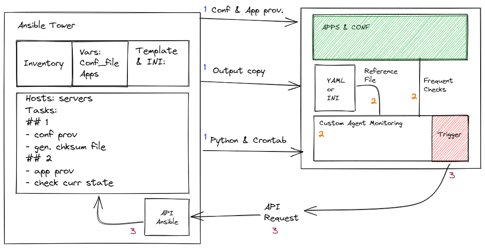

# Custom-Agent-Ansible 

## Description

This is supposed to be send to a slave node as a daemon or a cronjob to use ansible output as reference for any file modification, if any, it will send the master node or the Ansible Tower to re-do the whole provisioning of the server. In short, the concept tries to self-monitor itself, without having to install Ansible or ssh into the machine, just re-read facts. It's meant to avoid having anything network depend.

## How to use 

Not usable yet, only tested on my localhost. Feel free to try it on a simple demo playbook after creating a few files and returning the SHA256 checksums. The md5 are a bit tricky. 
I will provide more within the week and hopefully provide a full monitoring tool.

